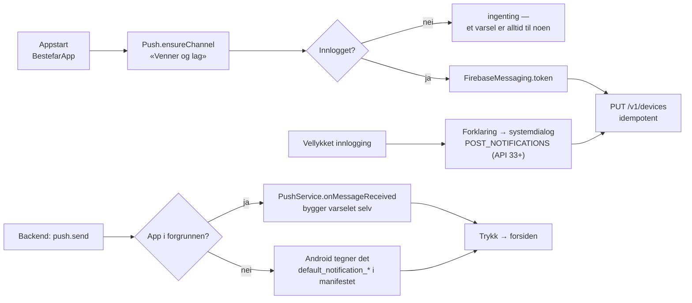
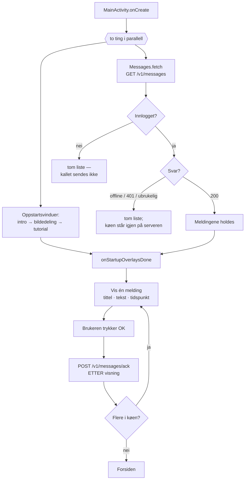

# Endringslogg — klienten (`android/`, `UI/`, `dist/`)

**Hva dette er:** hva som ble bygget, runde for runde. **Hva det ikke er:**
en beskrivelse av hvordan appen er nå.

Opprettet 2026-08-08. Alt under er **flyttet ordrett** hit fra to steder som
hadde begynt å drukne i sin egen historikk:

- `bestefar_UI_spec.md` §12–§24 — tretten endringslogg-seksjoner klistret på en
  spec med elleve seksjoner. Fila kunne ikke lenger leses forfra: de første
  elleve seksjonene beskrev v0.4, og for å vite hva som faktisk gjaldt måtte du
  lese tretten tillegg i rekkefølge og holde styr på hvilke som overstyrte
  hverandre.
- `docs/flytskjema.md`, seksjonene «Nytt i v0.15» til «Nytt i v0.19» — samme
  mønster, fjerde stadium. Diagrammene beskrev v0.14, og resten sto som lapper
  under.

**Hvor du finner nåtilstanden i stedet:**

| Spørsmål | Fil |
|---|---|
| Hvordan ser appen ut og hva skjer når | `docs/flytskjema.md` (diagrammer avledet fra kode) |
| Hva kan andre stole på over ledningen | `android/KONTRAKT.md` |
| Hvorfor ble det slik, hva ble forkastet | `android/ARCHITECTURE.md` |
| Hva er kravene | `bestefar_UI_spec.md` §1–§11 |

**Merk om diagrammer i denne fila:** de er historiske øyeblikksbilder fra runden
de tilhører, og oppdateres ikke. Gjeldende diagrammer står i
`docs/flytskjema.md`.

**Skriv ikke nye datostemplede tillegg inn i speccen eller flytskjemaet igjen.**
Nye runder føres inn her, og de to andre filene endres til å beskrive den nye
nåtilstanden.

---

## v0.21 — første sikkerhetskopi tilbys etter at kontoen er opprettet

- **`is_new` leses.** Feltet har ligget i innloggingssvaret siden v0.17 uten at
  noen brukte det. Det er det ene signalet som skiller «kontoen ble opprettet
  nå» fra «brukeren logget inn igjen», og dermed det ene øyeblikket appen vet at
  det finnes lokale data og ingen kopi noe sted. En bruker som logget inn og
  mistet telefonen dagen etter, hadde konto uten kopi — nøyaktig det kontoen
  finnes for å hindre.
- **Tilbudet kommer etter varseldialogen**, ikke samtidig. To vinduer som kappes
  om skjermen gir et «nei» til begge.
- **Gjenopprettingskoden vises før opplastingen**, ikke etter. En kopi på
  serveren som brukeren ikke har nøkkelen til, er det eneste utfallet som er
  verre enn ingen kopi.
- **Første visning krever avkryssing.** Dialogen kan ikke avbrytes, og knappen
  er deaktivert til brukeren har bekreftet at koden er skrevet ned et annet sted
  enn på telefonen. Ber brukeren *selv* om å se koden senere, er avkryssingen
  borte — da er den ren friksjon. `Store.backupCodeShown` var til nå et flagg
  som ble skrevet og aldri lest; nå styrer det dette.
- **Teksten sier hva som går tapt**, og at koden kan hentes fram igjen så lenge
  telefonen finnes. Det som ikke kan hentes igjen er koden til en telefon som er
  borte.
- Kodedialogen er flyttet fra `AvansertActivity` til `Dialogs`, siden to skjermer
  nå viser den.

## v0.20 — klienten rettet mot `contracts/openapi.json`

Første runde der klienten er gått gjennom mot den maskinlesbare kontrakten i
stedet for mot `backend_spec.md`. Alle ruter og verb stemte; fem avvik lå i
felter, parametere og grenser, og **alle fem var klientens feil**.

- **`client_ts` på `PUT /v1/backup` sendes som ISO-8601 med `Z`**, ikke lenger
  som epoke-millisekunder. Serveren tok imot begge, men ms-varianten hvilte på
  at parseren tolker store heltall som millisekunder og ikke som sekunder. Ble
  den tolkningen strengere, ville tidspunktet havnet titusener av år fram i tid
  og 409-vernet snudd — det ville sluppet gjennom nettopp den utdaterte enheten
  det finnes for å stoppe.
- **`app_version` sendes ikke lenger** på samme kall. Serveren tar ikke imot en
  slik parameter, og ukjente query-parametere forsvinner stille.
- **`schema_version` sendes nå**, fra `Backup.SNAPSHOT_VERSION`. Den er
  formatversjonen på innholdet, og serveren gir den tilbake i `/meta` så en ny
  telefon kan se om den kan lese kopien før den laster ned 16 MB.
- **Tilbakemeldingsskjemaet håndhever serverens lengdegrenser**: emne 200 tegn,
  melding 10 000, i selve feltet. `device_model` avkortes til 64. Uten det ga en
  telefon med langt fabrikant- og modellnavn 422 på hele tilbakemeldingen — og
  siden 422 ikke er 429, falt koden ut i mailto-grenen og åpnet e-postappen uten
  at noen skjønte hvorfor.
- **`client_ts` fra `/meta` leses med `isNull` først.** org.json gir strengen
  `"null"` for en JSON-null via `optString`, og feltet er nullable i skjemaet.
  Det virket, men bare fordi datoparseren feilet på riktig måte.

`device_id` sendes fortsatt ikke — hva ID-en skal være er et personvernvalg
like mye som et teknisk et. ÅP-U13.

---

# Del 1 — flyttet fra `docs/flytskjema.md`

### Nytt i v0.15

- **Sletting er soft-delete.** `deleteSeries`/`deleteHunts` setter `deletedAt`
  i stedet for å fjerne raden. Visningskoden ser ingen forskjell
  (`allSeries()`/`allHunts()` filtrerer), men `…Raw()` beholder gravsteinen så
  en gjenoppretting ikke legger inn igjen det brukeren har slettet.
- **Sikkerhetskopien er klient-kryptert.** `Backup.build()` → AES-256-GCM med
  nøkkel utledet fra en generert gjenopprettingskode; serveren lagrer bytes den
  ikke kan lese. Mister brukeren koden, er kopien tapt — og det står i dialogen.
- **🎛-ikonet.** Overalt der «Avanserte innstillinger» nevnes ligger det et
  equalizer-ikon som åpner siden direkte (`Ui.advancedIcon`).

### Nytt i v0.16

- **Nøkkelen til kopien søkes opp i tre lag** (`BackupKeys.resolve`): lokalt →
  Block Store → deponering hos serveren. Brukeren blir bedt om
  gjenopprettingskoden *bare* når ingen av dem har noe. Derfor spør
  «Sikkerhetskopier nå» ikke lenger om noe i det hele tatt.
- **Jaktloggen kan låses**, resten av appen aldri. Låsen ligger foran begge
  inngangene i Jakt-menyen, med fem minutters frist. Avvist opplåsing lukker
  ingenting — brukeren blir stående.
- **Felling-varselet forhåndsvises.** Setningen vennene får bygges i klienten
  (`Announce.speciesPhrase` eier bøyningen) og vises ordrett før den sendes.
- **Utlogging** (`Auth.logout`) er tre steg i fast rekkefølge: avregistrer
  enheten for push → tilbakekall refresh-tokenet → slett begge tokenene lokalt.
  Siste steg skjer uansett, også offline.

### Nytt i v0.17

- **Innlogging finnes.** Min profil → Konto → `LoggInnActivity`. Google via
  Credential Manager, eller sekssifret kode på e-post. Appen ber aldri om
  innlogging uoppfordret, og skjermen sier eksplisitt at alt annet virker uten
  konto.
- **Ingen data går tapt ved inn- eller utlogging.** Serier, jaktlogg og
  innstillinger er lokale og røres ikke av noen av delene.

### Nytt i v0.18 — push

- **Nei til varsler er et gyldig svar** — enheten registreres likevel, så
  varsler som skrus på senere virker med én gang.
- **Ingen ruting på varseltype ennå.** Alle varsler åpner forsiden; venne- og
  lagsidene er fortsatt skjelett, og en dyplenke til en tom skjerm er verre.

### Nytt i v0.19 — meldingskøen

Pushen over er *rask levering*. Diagrammet under er *garantien*: den veien som
også virker når pushen ikke kom fram.

- **Kvitteringen kommer etter visningen, ikke etter hentingen.** Serveren
  markerer raden i stedet for å slette den, nettopp for å tåle en klient som
  forsvinner imellom. Prisen er at en melding kan vises to ganger — den billige
  feilen av de to.
- **Meldingene holdes til oppstartsvinduene er ferdige.** Et nettverkssvar som
  lander midt i tutorialen skal ikke legge seg oppå den.
- **Hentes bare ved appstart.** En melding som kommer mens appen ligger åpen,
  vises først ved neste oppstart — med mindre pushen når fram.

---

# Del 2 — flyttet fra `bestefar_UI_spec.md` (§12–§24)

## 12. Endringslogg v0.6 (musingsUI runde 2–4)

Denne seksjonen overstyrer eldre beskrivelser der de er i konflikt.

### Navigasjon (endret fra §2)
- **Tre ikonknapper øverst:** Avstand, Innsikt, Meny. (Våpen, Jakt og Stilling er
  IKKE lenger i baren.) Hvitt motiv på sort med grå ramme; valgt = fylt/markert ramme.
  Meny-ikonet er 10 % mindre. Liggende: 60 % bredde; stående: 80 %.
- **Avstand** og **Meny** åpner som dropdown-paneler (trykk igjen lukker; kun avstand
  lukkes ved klikk utenfor). **Innsikt** er fullskjerm.
- **Scan serie**-knappen ligger i hovedflaten (nedre halvdel; full bredde liggende).
- **Stilling** velges KUN som prompt etter hvert scan (ikke i noen meny). Fire
  stillinger vertikalt med egne ikoner + antall skudd per stilling; hjelpemidler
  (anlegg/reim) horisontalt som radio-toggler («uten» = deaktivert). **Benk fjernet.**
- Hovedflate viser «## øvelsesskudd denne sesongen» øverst.

### Meny
Min profil (øverst) · Jakt · Venner · Mine serier · Gi tilbakemelding til utvikler ·
Hvordan bruke appen · Søk (nederst). Deling, Historikk, Om appen og optikk-kalkulator
er fjernet. «Mer statistikk» ligger nederst i Innsikt.

### Resultat/scan
- **OCR-finpussing** av poeng (ML Kit, on-device, UKALIBRERT heuristikk): ≤ 0,2 avvik
  → sømløs oppdatering; > 0,2 → «kunne ikke se treffene» med Forkast / Lagre med
  skjermpoeng, + bilde-donasjonsdialog.
- **Innskyting:** kalibreringssjekk på sesongens/dagens første serie(r).
- **Identiske serier:** varsel ved lagring. **Bare liggende bilder** gates.

### Profil
Visningsnavn, fødselsår (2–120), «Legg til jaktlag eller skytterlag», «La venner finne
meg», fortløpende lagring, tema-veksler (lys/mørk/system) øverst til høyre, «Mitt
jaktmål» (rater 1 av 7/13/20/50; 13 = nasjonalt snitt) med (i). Avanserte innstillinger:
Mine våpen (+ Legg til våpen), Flytt til ny telefon, Slett alle data. Optikk/ammo fjernet.

### Jakt (menyvalg)
To knapper: Registrer jaktskudd / Se registrerte skudd. Datovelger («3. mars 2026»).
«Del med forskning»-checkbox (av = forenklet visning). Posisjon m/rød pin under
viltknappene. Side 2: tre viltsilhuetter (hjort brukes på alle inntil videre) for
«Velg dyrets posisjon» + «Dyret løp ca X m» + Ettersøk/Bomskudd.

### Venner (front-end-skjelett)
Legg til venn (søk/ID/QR) · delingsvalg (visningsnavn perma) · lag med venner gruppert
under (offset) · flytt lag opp/ned · gråing når deling er av · endre visningsnavn (alias,
≤ 24 tegn ASCII). Ekte data/invitasjoner krever backend — se `backend_spec.md`.

### Tema
Lys brunfarge erstatter Material3-lilla; egen dag/natt-palett.

### Tutorial / oppstart
Oppstartsmelding (vindu 1 velkomst, vindu 2 bildedeling), vist første gang / ved
`STARTUP_MSG_VERSION`-bump. Tutorial = «Hvordan bruke appen» (Velkommen · Scan serie ·
Velg skytestilling · Innsikt), med «Avbryt»-knapp.

## 13. Endringslogg v0.7 (musingsUI runde 5)

Overstyrer eldre beskrivelser ved konflikt.

- **Innsikt** er nå en **matrise**: fem vilttyper (rader) rammet av jeger-stilling
  (topp), dyr-vinkling (bunn) og skuddhold (høyre kolonne). Silhuett skalerer med
  hold; frekvenstekst grønn = jaktmål nådd, rød = ikke, grå «øv på stillingen» der
  stilling mangler data. (i) forklarer fargene. Nytt klikk på Innsikt lukker den.
- **Meny:** «Melding til utvikler» (tittel = Subject); klikk utenfor lukker menyen.
- **Profil:** visningsnavn tillater latinske tegn (æøå); tema default lys, veksler
  «Velg visningsprofil», knapp viser gjeldende modus; «Mine jaktlag og skytterlag»
  liste; «Mitt jaktmål» tall bold+større + (i); «Avanserte innstillinger» egen
  knapp → undermeny (våpen, flytt, slett, venstrehåndsmodus, Utvikler-meny med
  Generer serie / Dummy scan / Vis oppstartsmelding hver gang).
- **Lag:** fullsides meny (Mine lag som innrykkede knapper, Rediger lag).
- **Jakt:** «Tilbake»-knapp; «Logg jaktskudd» ikke uthevet.
- **Logg jaktskudd:** «Skuddhold» (ikke Avstand), «Annet» krever tekst, ingen
  ledende 0, toaster avbryter hverandre, Bomskudd/«ikke funnet» krever ikke tall.
- **Se registrerte skudd:** klikk-og-hold flervalg-sletting, store piler,
  Rediger, fast OK-plassering.
- **Venner:** lag som innrykkede knapper → lagside med medlemmer; opp/ned-popup +
  «<=»-kollaps; delings-etiketter oppdatert; «Lagre» går til hovedsiden.
- **Oppstart:** fullskjerm-overlegg som dekker Scan-knappen; menylinje 5 % ned.
- **Optikk/ammo/kalkulator:** forblir fjernet (runde 4).

## 14. Endringslogg v0.8 (musingsUI runde 6)

- **Hovedskjerm:** kun antall øvelsesskudd + Scan-knapp (all annen clutter fjernet).
- **Samtykke:** jaktmål og forskning aldri på samme serie (jaktmål først,
  forskning tidligst 2 serier senere); ny forskningstekst; radioknapp-fiks.
- **Innsikt:** (i) på tittellinjen (fet grønn/rød, tema-tintet ikon); stilling- og
  vilt-valg som ikoner med ramme; viltnavn i default farge, tall grønn/rød; mørk-
  modus-farger; layout JJJJ / VT-rader + hold-kolonne / DDD; like store knapper.
- **Poeng-visning:** «Poeng:»-etikett; «… med anlegg/reim»; «Mitt gjennomsnitt for
  denne stillingen» uten KI; skiveringer korrigert (6 hvite + 5 sorte).
- **Profil:** «+ legg til nytt lag» som knapp; jaktmål over to linjer m/«Endre»;
  jaktlag-klikk åpner laget (TeamPage).
- **Jaktlag (TeamPage):** navn, Inviter medlemmer, medlemsliste (m/egen bruker),
  Rediger lag / Velg leder, Lukk — front-end-skjelett (avstemning/push = backend).
- **Jakt:** Tilbake går til hovedsiden.
- **Melding til utvikler:** subject/body i mailto-URIen.
- **Venner:** egen bruker i lag; venner i flere lag under hvert; flytt opp/ned
  fikset (Avbryt t.h.); delings-piler kraftigere + åpen som default; findable-
  varsel stabilt m/ny tekst.
- **Logg jaktskudd:** «Felling var vellykket»-checkbox + bekreftelse; «dyret løp»
  godtar 0 m (ikke sifre etter enslig 0); toast-tekst justert.
- **Se registrerte skudd:** tilbake → lista; store faste piler; nyeste samme-dag
  øverst; Rediger endrer alt; mørk-modus-silhuetter; flervalg «Slett alle» + popup.

## 15. Endringslogg v0.9 (musingsUI runde 7)

- **Topplinje:** flyttes faktisk ~5 % ned (2-args `addView(w,h)` nullet marginen
  før — nå 1-args så `topMargin` beholdes).
- **Oppstart:** «Vil du dele bilder …»-vinduet kan slås av i Avanserte innstillinger.
  Forskningens delings-checkbokser er auto-krysset første gang.
- **Popuper:** felles modell (setItems + Avbryt) på lister som manglet Avbryt.
- **Innsikt (ombygd):** (i) tydelig synlig (36 dp) t.h. for tittelen; valgt piktogram
  = sort (lys) / tekstfarge (mørk), uvalgt = grå; presentasjonssilhuett tekstfarget;
  viltnavn i default farge. «Stripe»-bug fikset (rammen ligger på en FrameLayout,
  bare bildet skaleres). Egne Innsikt-skalaer (liggende opp, sittende ned). Ramme:
  jeger-stilling høyrejustert over hold-kolonnen, dyr-vinkling venstrejustert under,
  hold-kolonne like bred som stående-ikonet og høy nok til å ramme matrisen, med
  tresifret tall + «m». Stillings-homogeniseringen (−65 %/+80 %) hører til
  stillingsvelgeren *etter scan*, ikke Innsikt.
- **Poeng-visning:** «Poeng:» foran totalen; dato «8. mars 2026    08:38» (luft
  mellom dato/tid); «Mitt gjennomsnitt for denne stillingen»; skivas ekstra hvite
  ytre halvring fjernet (maxR = 10). **Karusell** over viste serier i Serielogg med
  piler + OK; datoen animeres (3× → default, ~20 % ned/høyre, 1 s, avbrytbar) når
  dagen bytter. Dummy-scan gir 10 skudd.
- **Profil:** «+ legg til nytt lag» outlined (ikke uthevet); lag-rekkefølge følger
  Venner (sortOrder). Lag-«Slett»: eneste medlem → slettes; flere → forlat; eneste
  leder → oppløs for alle / overfør + forlat.
- **Jaktlag:** medlemmer klikkbare → karusell (piler går helt rundt + OK); lagleder
  merket «(Lagleder)» øverst, ellers alfabetisk; «Slett lag» i Rediger lag.
- **Venner:** dobbelt innrykk for lagmedlemmer.
- **Utvikler:** «Legg til venn» (navn + lag, 5 serier á 10 skudd).
- **Logg jaktskudd:** felling-checkbox også i forenklet (forsknings-av) flyt;
  posisjon logges også der; mørk-modus-tintede stilling-silhuetter. Skuddloggen viser
  kun «Felling vellykket/mislykket» (ikke «Utfall: Dødelig») i samme font. Rediger:
  etikett foran hvert felt, redigerbar dato, utfallsknapper stablet loddrett, «Skade»
  vist som «Ettersøk», «Dyret ble ikke funnet» kun ved Ettersøk.

## 16. Endringslogg v0.10 (musingsUI runde 8)

- **Fargeoppslag (rotårsak):** `Ui.themeColor` løser nå opp ColorStateList-attributter
  (særlig `android:textColorPrimary`) korrekt — tidligere ble ressurs-ID-en tolket som
  farge, så alt tintet med tekstfargen var «usynlig». Fikser vilt-silhuetter (lys/mørk),
  valgt piktogram i mørk, viltnavn-tekst og jaktlogg-silhuetter i mørk i én operasjon.
- **Topplinje:** margin 5 % → 2 % (3 % opp).
- **Forskning:** «Del med forskning»-bryter i Avanserte innstillinger (18-årsgate);
  auto-kryss kun når forskning er aktivert; nytt samtykke-spørsmål hver ny sesong
  (`researchConsentSeason`).
- **Oppstart:** bildedelings-spørsmålet popper ikke lenger; flyttet til «Del bilder med
  utvikler»-bryter i Avanserte innstillinger. Intro-vindu kun første gang / dev-flagg.
- **Innsikt:** (i) = UTF-8-glyf «ⓘ». Ramme-flukt: tre første stillinger venstrejustert
  (liggende over «forfra»-vilt), stående skjøvet helt til høyre over hold-kolonnen; luft
  mellom stående og 25 m; avstandsknapper like store som ikoncellene (60×54).
- **Stillingsvelger:** «Liggende» beholder aspekt (FIT_CENTER-ImageView i boks, ikke
  `iconSize`-kvadrat); «## skudd» teller skudd (`shotsCountByPosition`), ikke serier.
- **Serier:** «Lukk»-knapp nederst t.h., lista scroller ikke bak den.
- **Poeng:** «Poeng:»-overskrift i fet, samme størrelse som poengene. «Mitt gjennomsnitt
  for denne stillingen» brytes kun på stilling: «Denne sesongen: X / Totalt Y».
- **Logg jaktskudd:** «Felling var vellykket» uavkrysset default (→ bekreftelsesdialog
  ved uavkrysset). Rediger: «Bom»/«ikke funnet» fader ut, sletter og låser «Dyret løp».
- **Venner:** klikk på jaktlag åpner full lagside (deg selv i lista + «Rediger lag» for
  lagleder), samme som fra Min profil.

## 17. Endringslogg v0.11 (musingsUI runde 9)

- **Oppstart:** bildedelings-popup vises igjen — første gang, og én gang neste sesong
  hvis deling ikke er valgt (`shareDevImagesSeason`). Kommer etter intro-vinduet.
- **Avanserte innstillinger:** fjernet «spurt på nytt hver sesong»-hintet. «Fjern
  inaktiv lagleder» viser jaktlag-velger kun ved flere inaktive; ellers toast «Ingen
  inaktive lagledere funnet» (inaktivitet = backend §11, tom liste i skjelettet).
- **Innsikt:** alle fire stillinger inntil hverandre til venstre (smal 2 dp-stripe),
  stående i 4. kolonne over hold-kolonnen; matrisebredde låst til tre kolonner så
  hold-kolonnen lander under stående. Avstandsknapper = ikoncellenes størrelse.
  Mørk-modus-silhuetter tintes med varm lysebrun (colorPrimary #D8B79B). Nye
  art-spesifikke silhuetter for Elg og Villsvin (side + front; skrå bruker side).
- **Resultatkort:** poeng midtstilt under «Poeng:», tettere rader, «:» bak «Mitt
  gjennomsnitt for denne stillingen».
- **Serier:** lista klippes ved overkanten av «Lukk»-knappen (scroll-bunnmarg).
- **Logg jaktskudd (Rediger):** «Bom»/«ikke funnet» blokkerer avstandsfeltet
  umiddelbart (deaktivert + ikke fokuserbart); animasjonen blåser opp fonten (1,7×)
  mens tallet fader ut.

## 18. Endringslogg v0.13 (musingsUI runde 10)

(v0.12 var capture-runden fra felttesten på skytebanen — se `til_utvikler_v012.md`;
den rørte ikke UI-spesifikasjonen utenom scan-skjermen.)

- **Skjermorientering:** ALLE skjermbilder er låst til portrett. Kun `CaptureActivity`
  (Scan) er liggende (`sensorLandscape`).
- **Systemlinjer:** status- og navigasjonslinjen har svart bakgrunn med lyse ikoner i
  BÅDE lys og mørk visning. Appen melder seg ut av edge-to-edge-tvangen (targetSdk 35+
  ignorerer ellers `statusBarColor`), så systemet tegner baren selv.
- **Forskning er satt på pause** (`Dialogs.RESEARCH_ENABLED = false`): ingen
  forskningsdialoger i flyten, og bryteren «Del med forskning» i Avanserte innstillinger
  er låst av med forklarende hint. Checkboxen «Del med forskning» i Logg jaktskudd heter
  nå **«Detaljert visning»** og er rent et visningsvalg — den gjelder også for «Annet».
- **Duplikatsjekk:** to serier regnes bare som like hvis BÅDE poengene (< 0,05) OG
  treffpunktene stemmer. Treffene pares grådig, og hvert par må ligge innenfor
  **0,1 poeng** (rRel er i ringsteg, så ett ringsteg = ett poeng). Opp-ned-bilder gir
  identiske poeng men speilvendte treffpunkter, og meldes ikke lenger som duplikat.
- **Poengvisning (resultatkort):**
  - Blyanten per poenglinje er **fjernet** — OCR har overtatt korreksjonsrollen, og
    blyanten blokkerte plassen til høyre for de midtstilte poengene.
  - Finnes OCR-poeng, **tar de presedens** og vises i **skjermrekkefølge** (ikke sortert
    på verdi). Totalen følger det som vises.
  - Ved uenighet bytter visningene plass: OCR-poengene øverst, «Identifiserte treff:»
    nederst. Tekst: «Appen klarte ikke å se poengene riktig. Vil du lagre serien
    likevel?» med knappene «Forkast» / **«Lagre leste poeng»**.
- **Avvist analyse:** resultatskjermen anbefaler nytt bilde — «Bildet ble ikke korrekt
  analysert. Scan bildet på ny.» med «Avbryt» / «Scan». Signalet er analysens egen
  kvalitetsport (`status != OK`); ingen nytt cue fra CV-kjernen trengs.
- **Serier:** merking av flere serier oppdaterer kun radbakgrunn og knapper — lista
  bygges ikke om, så skjermen står stille (før hoppet den til toppen for hver merking).
- **Oppstart:** bildedelings-vinduet vises første gang appen åpnes, én gang neste sesong
  hvis deling ikke er valgt, og **alltid** når «Vis oppstartsmelding hver gang» er på i
  utviklermodus.
- **Innsikt:** rammen er nå 7 like høye rader som **autoskaleres etter skjermhøyden** så
  alt får plass på én skjerm: stillingsraden øverst + 6 rader i kroppen (5 vilttyper +
  vinkelraden). Hold-kolonnen har nøyaktig 6 knapper, så **200 m står rett til høyre for
  vinkel-/vilt-posisjonsvalgene**. Tekst- og knappestørrelser følger radhøyden. Nye
  silhuetter for **villrein** i alle tre vinkler (front/side/skrå) — første art med
  egen skrå-silhuett; elg og villsvin bruker fortsatt side-varianten på skrå.
- **Logg jaktskudd (Rediger):** tallet i «Dyret løp» vokser til **dobbel** størrelse og
  flyr **opp mot høyre** mens det fader ut (0,55 s). Foreldrene har `clipChildren=false`
  slik at animasjonen ikke klippes.
- **Avanserte innstillinger:** ny bryter **«Lagre scannede bilder i bildearkivet»**.
  Etter første scan spør appen «Ønsker du at skjermbildet skal lagres i bildearkivet
  ditt?» ‹Ja›/‹Nei›, etterfulgt av «Du kan endre dette valget i «Avanserte
  innstillinger»». Svarer man Nei, slettes også bildet fra den scanen.

## 19. Endringslogg v0.14 (backend-kobling, runde 1)

Første runde der appen faktisk snakker med en server. Alt annet fungerer som før
uten nett — offline-først er ikke svekket, bare supplert.

- **Melding til utvikler** går nå til `POST /v1/feedback` i stedet for å åpne
  e-postappen. Kvitteringer: «Sender …» → «Takk! Meldingen er sendt.» Feiler
  kallet, åpnes e-postappen som før («Fikk ikke kontakt. Åpner e-post i stedet.»).
  Er man rate-limitet (429) sier appen det rett ut i stedet for å lage duplikater
  via e-post. Tom melding avvises før sending.
- **Opplastingskøen er reell.** Bilder til feilanalyse (`ocr_match`,
  `ocr_mismatch`, `rejected`) ligger i en filbasert kø og sendes til
  `POST /v1/failed-analyses` ved appstart og på «Send nå». Tidligere ble de bare
  skrevet til disk og ble liggende for alltid.
- **«Send bildet til feilanalyse»** på avvist-skjermen sender nå faktisk bildet.
  Før viste knappen bare en kvittering og deaktiverte seg selv. Knappen er et
  eksplisitt samtykke for akkurat det bildet, uavhengig av den generelle
  bildedelings-bryteren, og vises bare når det finnes et bilde å sende.
- **Avanserte innstillinger** har fått:
  - **«Last kun opp på wifi»** (default på) — køen er fullskala-JPEG-er og skal
    ikke spise mobildata på skytebanen. «Send nå» overstyrer valget.
  - **«Send bilder til feilanalyse nå»** med levende status: «N bilde(r) venter
    på å bli sendt» / «Ingenting venter. Sist sendt \<dato tid\>». Knappen er
    deaktivert når køen er tom.
- **Øktoppsummering:** kø-linja teller nå det som faktisk kan sendes (bilder), og
  skjules når køen er tom. Den gamle telleren summerte serier + jaktlogg, som
  ingen kunne sende, og kunne derfor bare vokse.
- **Utviklermeny:** «API-adresse» lar en peke appen mot en annen backend (lokal
  maskin, staging) uten å bygge på nytt. Tom verdi = innebygd adresse.
- Ingen nye tillatelser brukeren merker: `INTERNET` og `ACCESS_NETWORK_STATE`
  krever ikke samtykke. Ingen data forlater telefonen uten at brukeren har sagt ja
  til bildedeling eller selv trykket «Send».

## 20. Endringslogg v0.15 (musingsUI runde 12)

### Systemlinjer
- **Svart statuslinje også i lys visning.** Fungerte i runde 10, sluttet å virke
  da `targetSdk` gikk til 36: Android ignorerer da
  `windowOptOutEdgeToEdgeEnforcement`, og `statusBarColor` blir en no-op.
  Appen tegner nå baren selv (`Ui.paintSystemBars`, registrert globalt i
  `BestefarApp`). No-op på enheter der opt-out-en fortsatt virker.

### Bildearkiv
- **«Lagre skjermbildene i bildearkivet?» har tre valg: Nei / Alle / De beste.**
  Erstatter av/på. «De beste» = blant de 25 % beste i SAMME stilling, eller
  beste serie noensinne. Valget kan ikke avgjøres ved fangst (poengene finnes
  først etter analysen), så bildet lagres alltid og ryddes bort igjen hvis
  serien ikke kvalifiserer. Gammel bryter migreres: på → Alle, av → Aldri.
- Samme tre valg i Avanserte innstillinger (Aldri / Alle / De beste).

### Avanserte innstillinger
- **Equalizer-ikon** (`ic_settings_sliders`) følger enhver henvisning til siden
  og åpner den: knappen i Min profil, dialogen etter første scan, og sidens egen
  tittel (der uten klikk — vi er framme). `Ui.advancedIcon()` er hjelperen nye
  henvisninger skal bruke.
- **Ny oppføring «Sikkerhetskopi»**: vis gjenopprettingskode, lag kopi,
  gjenopprett.

### Advarselsikon
- Rød advarselstrekant (`Ui.warningDialog()`) på dialoger der noe forsvinner og
  ikke kan hentes tilbake: slett skudd, slett serier, slett alle data,
  innskytingens «Ikke lagre» (som også sletter dagens første serie), og
  overskriv nyere sikkerhetskopi. **Ikke** på bekreftelser som bare er et
  veivalg — ellers slites ikonet ut.

### Scan og resultat
- «Poeng:» og poenglista ligger nå inntil **høyre** skjermkant.
- Avvist-skjermen: knappen heter «Scan på ny», og «Send bildet til feilanalyse»
  har fått ramme (var borderless og leste som brødtekst).

### Innsikt
- **Rådyr har egne silhuetter** (front/skrå/side). Falt tidligere gjennom til
  hjort — feil art, og den arten der forveksling betyr mest for
  skuddvurderingen.

### Jaktlogg
- Rediger-animasjonen viser bare tallet; feltets understrek fjernes mens
  animasjonen står på og settes tilbake etterpå (også ved avbrudd).

### Oppstart
- Bildedelings-meldingen har en stor emoji over teksten. Emojien ligger i
  `startup_donate_emoji` og kan byttes uten kodeendring.

### Data (ikke synlig i UI, men merkbart i oppførsel)
- **Soft-delete:** slettede serier og jaktposter blir stående som gravsteiner
  med `deletedAt`. Uten dem ville en gjenoppretting fra sikkerhetskopi legge
  inn igjen det brukeren har slettet.
- **Klient-kryptert sikkerhetskopi** (backend_spec §2). Nøkkelen utledes fra en
  generert gjenopprettingskode på 20 tegn som vises én gang. Mister brukeren
  koden, er kopien tapt — det står eksplisitt i dialogen, og følger av at
  serveren ikke kan lese bloben.

## 21. Endringslogg v0.16 (musingsUI runde 13)

### Dialoger
- **STOP-ikon** (`ic_stop`, `Ui.stopDialog`) på «Slett alle data» — det ene
  valget som fjerner alt. Advarselstrekanten betyr «tenk deg om»; åttekanten
  betyr «her stopper du». Skillet er verdiløst hvis åttekanten brukes to steder,
  så den brukes ett.
- **Innskyting, «Nei, ikke lagre»** har fått en tekst som sier hva som
  forsvinner: begge dagens serier, ikke bare den man står i. Logikken er
  uendret fra runde 4 — det var teksten som manglet.

### Jakt
- **Forhåndsvisning av felling-varselet.** Etter en vellykket felling vises den
  nøyaktige setningen vennene får («Ola har felt et villsvin i Molde.»), med
  stedet i et redigerbart felt som kan tømmes. Teksten oppdateres mens man
  skriver. Bare vellykkede fellinger tilbys; bom og ettersøk kunngjøres ikke.
  Kunngjøringen kommer etter lagringen og kan aldri stoppe den.
- **Valgfri opplåsing foran jaktloggen** (av som standard). Biometri eller
  skjermlås på «Registrer jaktskudd» og «Se registrerte skudd», med fem
  minutters frist. Avvist opplåsing lar brukeren stå der de sto. Resten av
  appen — scan, innsikt, serier, profil — er aldri låst; scan-flyten skal virke
  med hansker. Bryteren skjules helt på enheter uten skjermlås.

### Serier
- **Trendgraf** øverst på Serier-siden. X = dato over inntil to jaktår med
  sesongskiftet 1. april som loddrett strek; Y = poeng per skudd som rullende
  snitt over 20 skudd (dagens eget snitt når dagen har flere). Y-aksen skaleres
  slik at laveste punkt aldri ligger høyere enn en firedel opp — luft under
  kurven er nettopp det som får en flat utvikling til å se ut som framgang.
  Dagens eget snitt vises som en svak prikk ved siden av linja, og siste punkt
  tegnes åpent så lenge vinduet ikke er fullt. **Ingenting framskrives.**

### Sikkerhetskopi
- **Gjenopprettingskoden er degradert til nødutgang.** «Sikkerhetskopier nå»
  spør ikke lenger om noe: nøkkelen ligger i Block Store (når enheten har
  ende-til-ende-kryptering der), og koden vises bare når brukeren ber om den.
- **Nytt valg «Gjenopprett uten kode»** (av som standard). Hjelpeteksten sier
  rett ut at vi da holder nøkkelen og kan låse opp kopien — og at det kan den
  som bryter seg inn hos oss også.
- **Gjenoppretting spør om koden bare når ingen annen kilde har nøkkelen.**

### Konto (ikke synlig ennå, men bestemmende for oppførsel)
- Tokenene ligger Keystore-kryptert i en egen prefs-fil, utenfor
  sikkerhetskopien. Utlogging avregistrerer enheten for push, tilbakekaller
  refresh-tokenet og sletter begge tokenene lokalt — også offline. Fornyelse er
  serialisert bak én lås; to parallelle ville logget brukeren ut overalt.
- **Utlogging sletter aldri lokale data.**

## 22. Endringslogg v0.17 (innlogging)

### Konto
- **Min profil har fått en «Konto»-seksjon.** Knappen viser tilstanden i selve
  teksten: «Logg inn» når man ikke er innlogget, «Konto: <navn>» når man er det.
- **Ny skjerm `LoggInnActivity`** med to tilstander og ingen mellomting.
  Utlogget: hva kontoen gir (sikkerhetskopi, venner, lag) + «Fortsett med
  Google» + «Bruk kode på e-post». Innlogget: navn, bruker-ID (den vennene
  søker opp) og «Logg ut».
- **Appen ber aldri om innlogging uoppfordret.** Skjermen sier eksplisitt at
  scan, innsikt, serier og jaktlogg virker som før uten konto, og at ingenting
  allerede lagret går tapt ved innlogging.
- **Utlogging bekreftes uten advarselsikon.** Ingenting går tapt, og teksten
  sier det — det er nettopp det brukeren lurer på i det øyeblikket.
- **Google-knappen skjules** når appen er bygget uten web-klient-ID, framfor å
  vise en knapp som ikke kan virke. E-postveien står igjen.
- **Apple** vises som en setning, ikke en knapp: innloggingen kommer når
  utviklerkontoen finnes.

### E-postkode
- Sekssifret kode, ingen passord. «Send ny kode» teller ned fra verdien
  serveren oppga (`resend_after_seconds`) — nedtellingen er bekvemmelighet,
  serverens 429 er det som håndhever fristen.

## 23. Endringslogg v0.18 (push-varsler)

### Varsler
- **Appen mottar nå push.** Kjeden var brutt i midten: backenden kunne sende,
  klienten kunne be om å sende, men enheten ble aldri meldt inn. `Push.register`
  kalles ved hver oppstart (idempotent `PUT /v1/devices`) og gjør ingenting uten
  konto — et varsel er alltid til noen.
- **Varselkanalen «Venner og lag»** opprettes ved appstart, så brukeren kan
  styre den fra systeminnstillingene. Uten den havner bakgrunnsvarsler i
  «Diverse», som ikke kan skrus av alene.
- **Tillatelsen spørres etter innlogging**, ikke ved appstart, og med en
  forklaring før systemdialogen: hva varslene er (venn feller dyr, beskjed fra
  lag), at det ikke er noe annet, og at de kan skrus av. Et systemvindu uten
  kontekst får «nei», og på Android 13+ er det «nei-et» nesten permanent.
- **Nei er et gyldig svar.** Enheten registreres uansett, slik at varsler som
  skrus på senere i systeminnstillingene virker med én gang.
- **Trykk på varselet åpner forsiden.** Ingen ruting på varseltype ennå — en
  dyplenke til en tom skjerm er verre enn en til forsiden, og venne-/lagsidene
  er fortsatt skjelett.
- **Varselikonet** er en skive med to ringer og blink. Android tegner
  varselikoner som silhuett, så form er det eneste som overlever; aksentfargen
  er appens brune.

## 24. Endringslogg v0.19 (meldingskøen)

### Beskjeder ved oppstart
- **Ventende beskjeder vises nå ved appstart.** Push er rask levering, men den
  når ikke fram til en bruker som har avslått varsler, en telefon som var av,
  eller et rotert FCM-token. Beskjedene ligger i en kø hos serveren, og fram til
  nå hentet ingen den — så en beskjed som ikke kom som push, kom aldri.
- **Én beskjed om gangen**, i samme fullskjermsform som oppstartsmeldingen:
  overskrift, tekst, og tidspunktet som en dempet linje under. Tidspunktet står
  for seg selv fordi det ikke er en del av beskjeden — det er når den kom.
- **Beskjedene kommer etter oppstartsvinduene**, ikke oppå dem. Et nettverkssvar
  som lander midt i tutorialen skal ikke overta skjermen.
- **Teksten vises ordrett slik serveren sendte den.** Klienten omskriver ikke,
  forkorter ikke og reparerer ikke. Beskjedene er ting som «Lagleder har fjernet
  deg fra Storlia» og «Ola vil gjøre deg til lagleder — bekreft i appen».
- **En beskjed kan i sjeldne tilfeller vises to ganger.** Kvitteringen sendes
  først etter at beskjeden er vist, ikke når den hentes, slik at en app som
  lukkes underveis ikke mister den. Å se den samme beskjeden om igjen er en
  billigere feil enn å aldri se den.
- **Ingenting vises uten konto**, og et mislykket kall er stille: appen starter
  som før, og køen hentes ved neste oppstart.

### Kjent begrensning
- **Beskjeder som ber om en handling kan ennå ikke besvares i appen.** «Bekreft
  i appen» og «Avstemningen er åpen i 7 dager» vises som tekst; det finnes ingen
  knapp som fører til laget, fordi lagsidene fortsatt er lokale skjeletter uten
  server-kobling. Beskjeden når fram — svaret kan ikke gis ennå.
