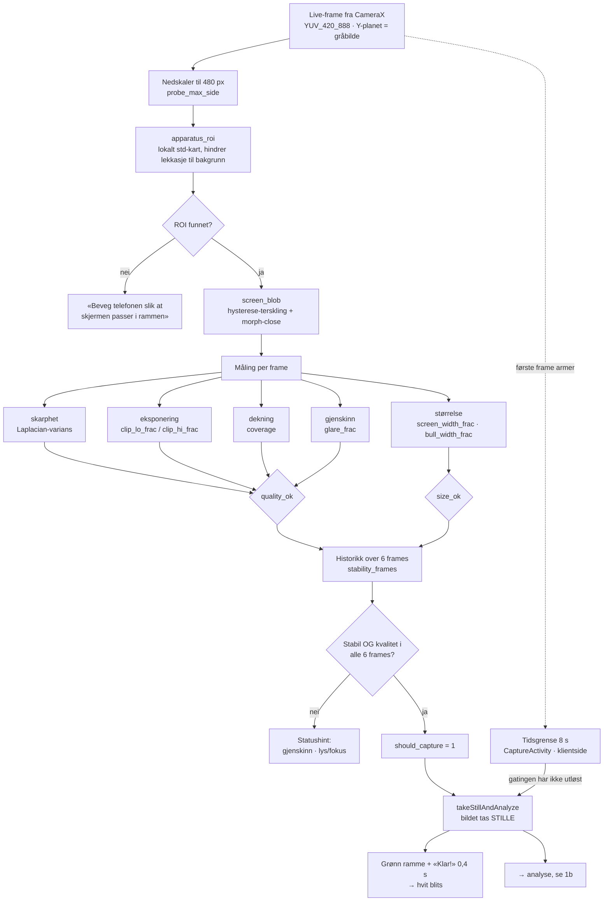
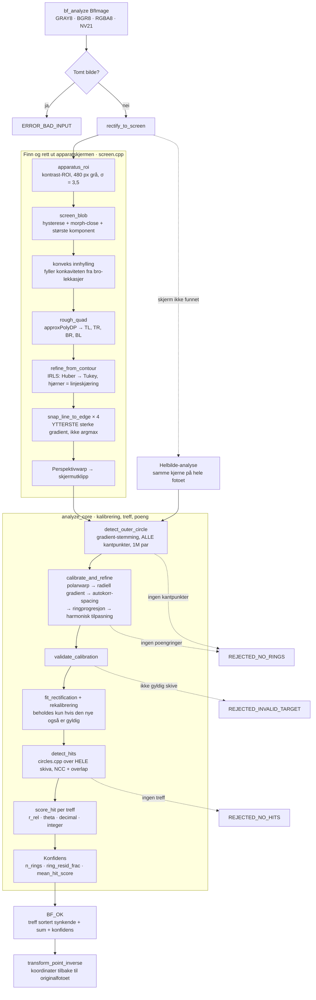
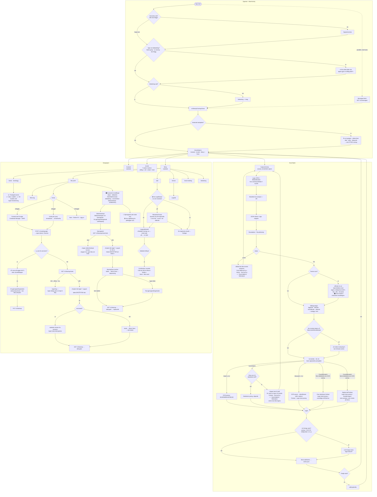
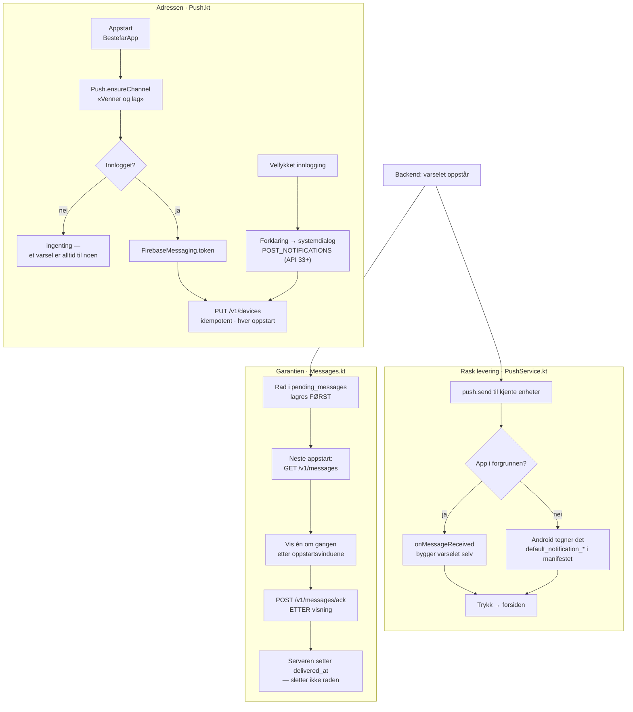

# Flytskjema

Tre flyter: **CV-kjernen** (`core/`, C++17 bak en ren C-FFI), **UI-et**
(`android/`, Kotlin med programmatiske views), og **varselveien** mot backend.
De to første møtes ett sted — JNI-kallet `BestefarCore.analyze()` i
`CaptureActivity`.

Diagrammene er avledet fra koden slik den står i v0.19, ikke fra spesifikasjonen.
Stadienavn er de faktiske funksjonsnavnene, så de kan søkes opp direkte.

**Dette dokumentet beskriver appen slik den er nå.** Hva som ble bygget når,
står i `android/CHANGELOG.md` — ikke skriv «Nytt i v0.NN»-seksjoner inn her
igjen.

---

## 1. CV-kjernen

### 1a. Auto-capture — `core/src/autocapture.cpp`

Kjører på hver live-frame fra CameraX, ~10 ms budsjett. Alle terskler er
**ukalibrerte** startverdier (kravspec §4).

**Capture-first** (felttest skytebanen, v0.12): bildet tas i det øyeblikket
kriteriene er oppfylt, og UI-et spilles av *etterpå* mens analysen allerede
kjører. Holdevinduet ble kuttet fra 24 til 6 frames — 24 fantes bare fordi den
gamle flyten glødet grønt *før* capture, og ett dårlig frame nullstilte vinduet.

**Tidsgrensen** (v0.29) er den stiplede veien i diagrammet, og den er
**klientside** — `bf_analyze` er en egen FFI-inngang som tar piksler, så en
capture uten `should_capture` går til nøyaktig samme analyse uten å røre
tilstandsmaskinen i `autocapture.cpp`. Utløser ikke gatingen innen 8 sekunder
fra første gatede frame, tas gjeldende ramme likevel. Brukeren ser ingen
nedtelling og ingen forskjell: samme grønne ramme, samme blits.

Grunnen er at de to utfallene «gatingen slapp aldri noe gjennom» og «kjernen
kjørte og feilet» så helt like ut — begge ga *ingenting*. Lykkes analysen etter
en timeout, er tersklene for strenge (ÅP-K1); feiler den, er det en ordinær
feilet analyse. Donasjonen bærer `capture_trigger` i sidecaren for å skille
dem. **Serveren tar imot feltet fra 2026-08-22** (issue #11 lukket, B-53):
`capture_trigger` ∈ {`auto`, `timeout`} som eget multipart-felt ved siden av
`tag`. **Klienten sender det ikke ennå**, så inntil den gjør det står feltet
tomt på alle rader — og tomt betyr «ikke oppgitt», ikke `auto`.

### 1b. Analyse — `core/src/analyze.cpp`

**Statuskoder** (`bestefar_ffi.h`) — UI-et bruker `status != OK` som det harde
signalet «dette kan jeg ikke score», og det er dette som utløser re-scan-dialogen.

| Kode | Verdi | Utløses av |
|---|---|---|
| `BF_OK` | 0 | Gyldig kalibrering og minst ett treff |
| `BF_REJECTED_NO_SCREEN` | 1 | *Definert, men ikke emittert* — se merknad |
| `BF_REJECTED_NO_RINGS` | 2 | `detect_outer_circle` eller `calibrate_and_refine` feilet |
| `BF_REJECTED_INVALID_TARGET` | 3 | `validate_calibration` avviste skiva |
| `BF_REJECTED_NO_HITS` | 4 | Ingen treff funnet (`gate_require_hits`) |
| `BF_ERROR_BAD_INPUT` | 100 | Tomt bilde |
| `BF_ERROR_INTERNAL` | 101 | Uventet exception |

**Merknad om `NO_SCREEN`:** koden er definert i `types.h`, men `analyze_target`
returnerer den aldri. Finner ikke `rectify_to_screen` en skjerm, faller vi
*alltid* gjennom til helbilde-analyse. Flagget `analyze_screen_fallback`
(default `false`) gjelder kun tilfellet «skjerm funnet, men crop-analysen
feilet» — da returneres crop-resultatets egen avvisningskode.

---

## 2. UI-flyten

### Tre ting verdt å merke seg i flyten

- **OCR har presedens.** Finnes OCR-poeng, er det de som vises — usortert, i den
  rekkefølgen de står på apparatskjermen. Totalen regnes av det som vises, så
  liste og sum aldri spriker.
- **To uavhengige kvalitetsporter.** `status != OK` fanger «jeg fikk ikke
  kalibrert skiva»; OCR-uenighet fanger den vanskeligere klassen der analysen
  *lyktes* men leste feil — typisk opp-ned-bildene.
- **Antallet er en egen kontroll, ikke en del av verdi-sammenligningen.** En
  serie er 0–10 skudd; kjernens `BF_MAX_HITS` (32) er en bufferstørrelse. Er
  antallet detekterte treff og antallet OCR-poeng ulikt, forteller *retningen*
  hvilken feil det er — flere detekterte er over-deteksjon (treffet finnes ikke,
  OCR kan ikke redde poengene), færre er skjulte treff (OCR-presedens gir riktig
  sum). Uten OCR-fasit er 10 en hard grense: serien kan ikke lagres.
- **Alt er offline.** `Store` skriver `series.json` / `hunts.json` i appens egen
  filkatalog. Appen virker uten konto; venner/lag er front-end-skjelett (se
  `backend_spec.md`). Nettet brukes til feilanalyse-køen, sikkerhetskopien,
  innloggingen og beskjedene — aldri til noe brukeren trenger for å skyte en
  serie.
- **Sletting er soft-delete.** `deletedAt` settes, raden blir stående.
  Visningskoden ser ingen forskjell (`allSeries()`/`allHunts()` filtrerer), men
  `…Raw()` beholder gravsteinen så en gjenoppretting ikke legger inn igjen det
  brukeren har slettet.
- **Beskjedene kommer sist i oppstarten, ikke oppå den.** Hentingen starter
  parallelt med oppstartsvinduene, men resultatet holdes til
  `onStartupOverlaysDone`. Hver utgang av oppstartskjeden må kalle den — en gren
  som glemmer det, gir en bruker som aldri ser beskjedene sine.

---

## 3. Varsler og beskjeder — to veier, én garanti

Backenden legger §11-varsler i en kø **før** den sender push. Køen er
garantien; pushen er rask levering. Klienten leser begge.

- **Pushen kan mislykkes uten at beskjeden går tapt.** Avslått varseltillatelse,
  rotert FCM-token, telefonen av, oppbrukt push-budsjett — beskjeden ligger
  fortsatt i køen og vises ved neste appstart.
- **Meldingen må ha en `notification`-blokk.** Ligger appen i bakgrunnen, er det
  Android selv som tegner varselet ut fra den; `onMessageReceived` kjøres bare i
  forgrunnen. En ren `data`-melding ville vært usynlig i det vanligste
  tilfellet, uten at noen part ser en feil.
- **Kvitteringen kommer etter visningen.** Serveren markerer i stedet for å
  slette, nettopp for å tåle en klient som forsvinner imellom. Prisen er at en
  beskjed kan vises to ganger — den billige feilen av de to.
- **Nei til varsler er et gyldig svar.** Enheten registreres likevel, så varsler
  som skrus på senere virker med én gang — og køen virker uansett.
- **Ingen ruting på `kind`.** Alle varsler og beskjeder ender på forsiden.
  Venne- og lagsidene er lokale skjeletter uten server-kobling, så en dyplenke
  ville landet på en skjerm som ikke kjenner `team_id`. Følgen er at beskjeder
  som ber om et svar («Bekreft i appen») **når fram, men ikke kan besvares**.

---

## Historikken

Hva hver runde endret, står i `android/CHANGELOG.md`. Denne fila beskriver
appen slik den er **nå** — seksjonene «Nytt i v0.15» til «Nytt i v0.19» ble
flyttet ordrett dit 2026-08-08, fordi diagrammene hadde blitt stående på v0.14
med fem lag lapper under. Endrer du appen, endrer du diagrammet.

