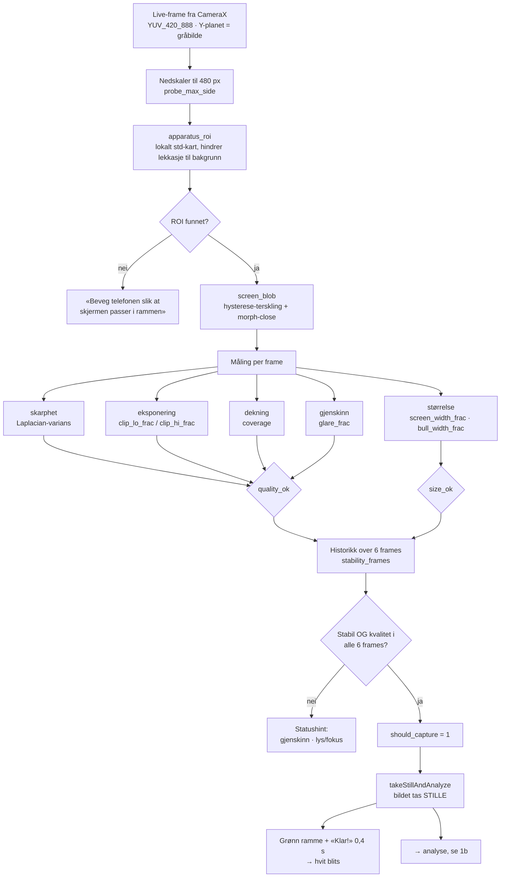
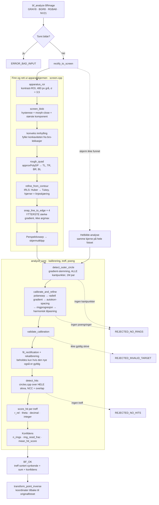
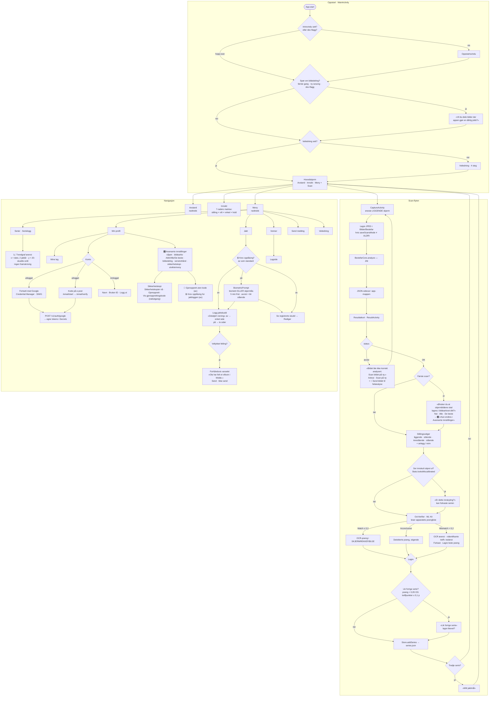

# Flytskjema

To flyter: **CV-kjernen** (`core/`, C++17 bak en ren C-FFI) og **UI-et**
(`android/`, Kotlin med programmatiske views). De møtes ett sted — JNI-kallet
`BestefarCore.analyze()` i `CaptureActivity`.

Diagrammene er avledet fra koden slik den står i v0.17, ikke fra spesifikasjonen.
Stadienavn er de faktiske funksjonsnavnene, så de kan søkes opp direkte.

---

## 1. CV-kjernen

### 1a. Auto-capture — `core/src/autocapture.cpp`

Kjører på hver live-frame fra CameraX, ~10 ms budsjett. Alle terskler er
**ukalibrerte** startverdier (kravspec §4).

**Capture-first** (felttest skytebanen, v0.12): bildet tas i det øyeblikket
kriteriene er oppfylt, og UI-et spilles av *etterpå* mens analysen allerede
kjører. Holdevinduet ble kuttet fra 24 til 6 frames — 24 fantes bare fordi den
gamle flyten glødet grønt *før* capture, og ett dårlig frame nullstilte vinduet.

### 1b. Analyse — `core/src/analyze.cpp`

**Statuskoder** (`bestefar_ffi.h`) — UI-et bruker `status != OK` som det harde
signalet «dette kan jeg ikke score», og det er dette som utløser re-scan-dialogen.

| Kode | Verdi | Utløses av |
|---|---|---|
| `BF_OK` | 0 | Gyldig kalibrering og minst ett treff |
| `BF_REJECTED_NO_SCREEN` | 1 | *Definert, men ikke emittert* — se merknad |
| `BF_REJECTED_NO_RINGS` | 2 | `detect_outer_circle` eller `calibrate_and_refine` feilet |
| `BF_REJECTED_INVALID_TARGET` | 3 | `validate_calibration` avviste skiva |
| `BF_REJECTED_NO_HITS` | 4 | Ingen treff funnet (`gate_require_hits`) |
| `BF_ERROR_BAD_INPUT` | 100 | Tomt bilde |
| `BF_ERROR_INTERNAL` | 101 | Uventet exception |

**Merknad om `NO_SCREEN`:** koden er definert i `types.h`, men `analyze_target`
returnerer den aldri. Finner ikke `rectify_to_screen` en skjerm, faller vi
*alltid* gjennom til helbilde-analyse. Flagget `analyze_screen_fallback`
(default `false`) gjelder kun tilfellet «skjerm funnet, men crop-analysen
feilet» — da returneres crop-resultatets egen avvisningskode.

---

## 2. UI-flyten

### Tre ting verdt å merke seg i flyten

- **OCR har presedens.** Finnes OCR-poeng, er det de som vises — usortert, i den
  rekkefølgen de står på apparatskjermen. Totalen regnes av det som vises, så
  liste og sum aldri spriker.
- **To uavhengige kvalitetsporter.** `status != OK` fanger «jeg fikk ikke
  kalibrert skiva»; OCR-uenighet fanger den vanskeligere klassen der analysen
  *lyktes* men leste feil — typisk opp-ned-bildene.
- **Alt er offline.** `Store` skriver `series.json` / `hunts.json` i appens egen
  filkatalog. Appen virker uten konto; venner/lag er front-end-skjelett (se
  `backend_spec.md`). Nett brukes kun til feilanalyse-køen og sikkerhetskopien.

### Nytt i v0.15

- **Sletting er soft-delete.** `deleteSeries`/`deleteHunts` setter `deletedAt`
  i stedet for å fjerne raden. Visningskoden ser ingen forskjell
  (`allSeries()`/`allHunts()` filtrerer), men `…Raw()` beholder gravsteinen så
  en gjenoppretting ikke legger inn igjen det brukeren har slettet.
- **Sikkerhetskopien er klient-kryptert.** `Backup.build()` → AES-256-GCM med
  nøkkel utledet fra en generert gjenopprettingskode; serveren lagrer bytes den
  ikke kan lese. Mister brukeren koden, er kopien tapt — og det står i dialogen.
- **🎛-ikonet.** Overalt der «Avanserte innstillinger» nevnes ligger det et
  equalizer-ikon som åpner siden direkte (`Ui.advancedIcon`).

### Nytt i v0.16

- **Nøkkelen til kopien søkes opp i tre lag** (`BackupKeys.resolve`): lokalt →
  Block Store → deponering hos serveren. Brukeren blir bedt om
  gjenopprettingskoden *bare* når ingen av dem har noe. Derfor spør
  «Sikkerhetskopier nå» ikke lenger om noe i det hele tatt.
- **Jaktloggen kan låses**, resten av appen aldri. Låsen ligger foran begge
  inngangene i Jakt-menyen, med fem minutters frist. Avvist opplåsing lukker
  ingenting — brukeren blir stående.
- **Felling-varselet forhåndsvises.** Setningen vennene får bygges i klienten
  (`Announce.speciesPhrase` eier bøyningen) og vises ordrett før den sendes.
- **Utlogging** (`Auth.logout`) er tre steg i fast rekkefølge: avregistrer
  enheten for push → tilbakekall refresh-tokenet → slett begge tokenene lokalt.
  Siste steg skjer uansett, også offline.

### Nytt i v0.17

- **Innlogging finnes.** Min profil → Konto → `LoggInnActivity`. Google via
  Credential Manager, eller sekssifret kode på e-post. Appen ber aldri om
  innlogging uoppfordret, og skjermen sier eksplisitt at alt annet virker uten
  konto.
- **Ingen data går tapt ved inn- eller utlogging.** Serier, jaktlogg og
  innstillinger er lokale og røres ikke av noen av delene.
